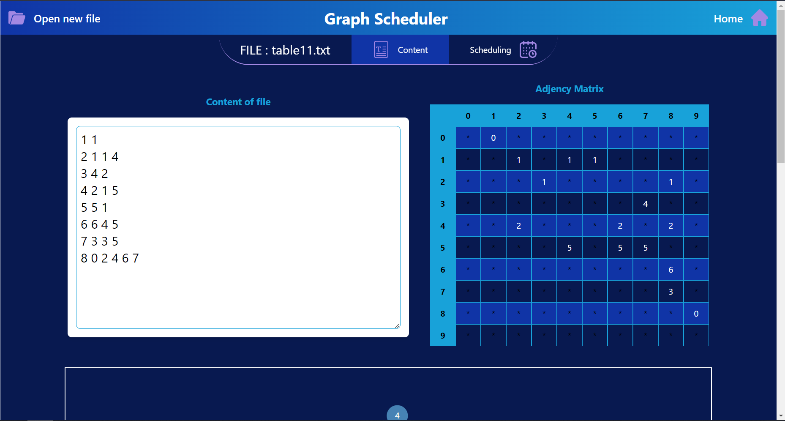

# Graph Scheduler

Graph Scheduler is a tool for finding the optimal schedule for a set of tasks. The web interface allows you to browse through pre-defined graphs and find the optimal schedule for them.

To run the web interface, you need to have [Node.js](https://nodejs.org/en/) installed. Then, you will need to run the backend server. To do so, run the following commands from the root directory of the project:

```bash
cd api
pip3 install -r requirements.txt
python3 api.py 
```

Then, from a new terminal still in the root folder run the following commands:

```bash
cd front
npm install
npm run dev
```

The web interface will be available on [this link](http://127.0.0.1:5173/).

## How to use the web interface

### About

You are first welcomed with the front page of the web interface. From the left panel, you can select a graph to find the optimal schedule for.


### Content

When selecting a file, you will be redirected to the content page of the graph, which contains information about the graph: adjency matrix, graph scheme, edges table and constranits table. Here is a screenshot of the content page:



### Schedule

When clicking on the "scheduling" button, you will be redirected to the schedule page, which will test if the graph can be scheduled. If possible, by clicking on Schedule graph you will be able to see the schedule graph button. Here is a screenshot of the schedule page:


Don't hesitate to contact us if you have any questions.